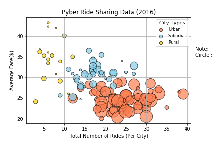
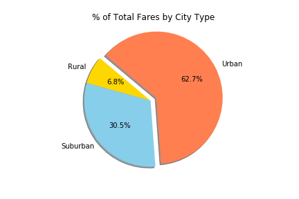
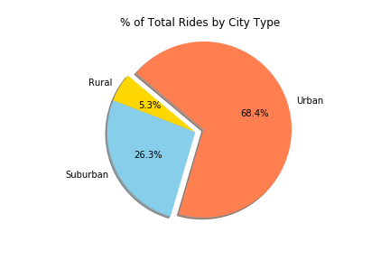
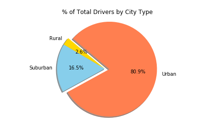

# The Power of Plots - Pyber

A dataset that contains riding data from a ride-share app, Pyber, is analyzed with Python and Matplotlib using Jupyter Notebook.

A bubble chart is created to show the relationship between average fare per city, total number of rides per city, total number of drivers per city, and city type.

Moreover, three pie charts illustrating percentages of total fares, rides, and rivers by city type are also created.

For codes, refer to `pyber_Soobin.ipynb`.

The main observations for the analysis are as follows:
1. Average fare is in rural cities is the highest when compared to that of other city types.
2. There is an inverse relationship between average fare and number of rides. In other words, lower average fare is observed where more rides are available.
3. Urban cities have the most drivers and most number of rides.

The following screenshots support the analysis above:

